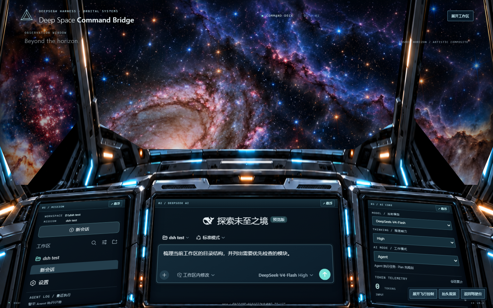

# 深空指挥舰桥 · Deep Space Command Bridge

面向 **DeepSeek Harness（DSH）** 的独立科幻驾驶舱主题。任务屏、主控制台和 AI 核心屏由原生 DSH 节点驱动，舱外是连续的深空星景，整舱可转头、拉近和拉远。

[](https://github.com/yunxiang1218/dsh-skin-deep-space-command-bridge/actions/workflows/ci.yml)
[](LICENSE)



[实机航速与整舱视角演示](preview/flight-demo.mp4) · [抬头观景](preview/observation.png) · [转向与舱壁](preview/cabin-far.png) · [跃迁航速](preview/warp.png) · [屏幕悬浮](preview/floating.png)

> 本项目是社区第三方主题，**不是 DeepSeek 官方产品**，也与 NASA、ESA、CSA、STScI 无关。素材署名与商标说明见 [NOTICE](NOTICE) 与 [assets/resource/CREDIT.md](assets/resource/CREDIT.md)。

## 环境要求

- **DSH Desktop**（本主题针对已安装的官方 `0.1.2-rc.1` 开发与验证）
- 用于安装的 **git**；`dsh plugin` 通过 pnpm 安装，需要 `pnpm 10+`（DSH Desktop 自带的 `.desktop-bin` 垫片已包含）
- 浏览器需支持 DSH 所需的新 API，推荐当前版本的 Chromium/Edge

## 安装

### 方式一：从 GitHub 安装（推荐）

```powershell
dsh plugin --profile web add "github:yunxiang1218/dsh-skin-deep-space-command-bridge"
```

`dsh` 不在 PATH 时，用 DSH Desktop 自带的 Node 与 CLI 调用：

```powershell
$app = "$env:LOCALAPPDATA\Programs\DSH Desktop\resources\app\node_modules"
& "$app\node\bin\node.exe" "$app\@deepseek-ai\dsh\lib\bin.js" plugin --profile web add "github:yunxiang1218/dsh-skin-deep-space-command-bridge"
```

命令会在目标 profile 中安装本包，并因为包内声明了 `dsh.bundle.patch` 而自动把 `@dsh-external/dsh-client-ui-skin-deep-space-command-bridge` 追加到 `dsh.profile.bundles`。

### 方式二：从本地目录安装（开发用）

```powershell
git clone https://github.com/yunxiang1218/dsh-skin-deep-space-command-bridge.git
cd dsh-skin-deep-space-command-bridge
npm ci
npm run build
dsh plugin --profile web add "<克隆目录的绝对路径>"
```

`lib/client.js` 与 `lib/index.js` 已随仓库提交，直接用目录安装即可加载；只有修改了 `src/` 才需要重新 `npm run build`。

### 方式三：离线安装包

```powershell
npm ci
npm run pack:theme          # 生成 dsh-external-dsh-client-ui-skin-deep-space-command-bridge-<version>.tgz
dsh plugin --profile web add "<tgz 的绝对路径>"
```

### 启用主题

在目标 profile（默认 `<DSH home>\profiles\web`）的 `cordis.patch.yml` 中启用本主题；整页皮肤之间应互斥：

```yaml
- id: ui-skin-maid-atelier
  disabled: true
- id: ui-skin-deep-space-command-bridge
  disabled: false
```

随后**重启 Harness**（DSH Desktop 窗口菜单 → 重启 Harness）。新增浏览器插件条目需要重启或全新启动宿主；已打开的页面不会热增插件。

### 卸载与回退

```powershell
dsh plugin --profile web remove @dsh-external/dsh-client-ui-skin-deep-space-command-bridge
```

只想临时换回原皮肤时不必卸载，把上文的两个开关对调并重启即可。

### 常见问题

- **路径被拆开或装错包**：`dsh plugin` 在 Windows 上经 shell 转发参数，含空格的路径需要额外一层引号（例如 `'"D:\my plugins\skin"'`），或直接把仓库克隆到不含空格的目录。
- **提示 `pnpm not found on PATH`**：把 DSH Desktop 的垫片目录 `%APPDATA%\dsh-desktop\harness\.desktop-bin` 加入 PATH，或自行安装 pnpm 10+。
- **安装后界面没变化**：确认已完成重启；若仍无变化，检查 `dsh.profile.bundles` 中是否已包含本包，以及 `cordis.patch.yml` 中行 id `ui-skin-deep-space-command-bridge` 未被禁用。

## 舰桥功能

- **MISSION PANEL**：保留原生工作区和历史对话树，补充当前任务摘要、最近 Agent 工具日志及工具成功写入的文件状态。
- **AI CORE PANEL**：直接显示和切换真实模型、Thinking 强度、Agent/Plan 模式，显示会话累计 Token 和上下文压力。
- **中央主屏**：原生聊天、输入、输出、附件、审批、设置与工作台继续由 DSH 负责。主题不发送聊天请求，不替换原生编辑器。
- **宇宙舷窗**：NASA/ESA 的 M83、Westerlund 2 与 Webb 星云照片经 Image Gen 合成为艺术星景，通过三个窗口显示同一连续场景；不含行星。原始观测照片也保留在资源目录中，合成图不代表真实天体空间关系。
- **飞行控制**：右下角可展开/收起，默认收起；缓慢是轻柔漂移，快速有明显前进和短星轨，极快形成蓝色跃迁通道与长光束。加减速、拖尾和辉光连续缓冲，进入停泊逐步减速后停止绘制。首次启动默认缓慢巡航；模式、航速和视角保存在当前浏览器中。
- **整舱观察**：“拖动观察船舱”控制整个前方船舱偏航/俯仰，各 ±60°；“观察距离”0.7–1.6 同时改变人到驾驶台和舷窗的远近。舱体、舷窗和嵌入屏幕使用同一物理相机，外景景深不受距离滑块控制。方向键、加减键、Home 可操作；独立浮窗保持稳定。
- **高舷窗与观景**：“抬头观景”将视线转向高舷窗，工作屏移到视野下方；“返回驾驶台”恢复默认姿态。转头及远景暴露的区域由具有金属加工细节的侧壁、顶棚与地板覆盖。
- **三屏悬浮**：任务屏、主控制台、AI 核心屏各有“悬浮/嵌回”按钮，可独立展开为平面工作窗口。右上角“展开工作区/返回舰桥”切换主控制台。切换不重建原生编辑器，保留草稿；原生对话框出现时，其所在屏幕自动平铺，详情面板使用独立浮层。
- **动态细节**：金属舷窗骨架、拉丝钛合金舱壁、机械接缝、冷却槽、灯带、玻璃屏幕与启动淡入。停泊减速完成后、页面隐藏时停止持续绘制；系统“减少动态效果”设置优先。

模型/推理选项完全来自当前会话的 DSH 模型目录。未提供的数据显示不可用，不生成虚构数值。文件状态表示当前已加载事件窗口内的成功工具写入，不等同于完整磁盘文件树。窄窗口把 AI 仪表堆叠在原生工作区下方，保留编辑区域宽度。

## 配色与 token 覆盖

座舱在明暗两种系统主题下都应呈现同一套深色外观，因此主题把官方主题中**所有按明暗取值不同的 token**（`--dsw-alias-*`、`--dsw-specific-*`、思考区渐变蒙版等）以及主题工作室可覆盖的全部颜色 token 都显式钉死为座舱配色，共 82 项，明暗取值一致。

这一点很关键：行内 `code` 使用的是 `--dsw-alias-markdown-inline-code`。皮肤若未覆盖它，该 token 会回落到官方的亮色取值（近白 `#ebeef2`），而座舱文字是浅色的，就会出现“白底浅字”看不清。现在行内 code 为深藏青底 `#22384a` + 浅色字 `#e5edf1`（对比度约 9:1），代码块、引用、标签、气泡、侧栏悬停、下拉菜单、滚动条、告警底色等同类 token 一并覆盖。

若在此基础上定制配色，建议保持“明暗两态同值”，否则系统主题切换时会出现同类错配。实现见 `src/client/palette.js`。

## 兼容性

当前适配目标为 DSH `0.1.2-rc.1`，在已安装的官方运行环境上验证。第三方皮肤与不同版本的布局选择器可能需要重新验证；`skin.json` 中的 `dshCompatibility` 不是可靠的版本闸门，请以实际安装的代码为准。

主题应与其他整页皮肤互斥启用，通过 profile 的 `cordis.patch.yml` 开关切换，不需要修改其他皮肤的文件。若同时启用「主题工作室」（`dsh-theme-plugin`），其推导出的 token 会与皮肤叠加；本主题已覆盖其全部颜色 token，因此座舱配色不会被改写。

## 开发与检查

```powershell
npm ci
npm run build          # 生成 lib/client.js 与 lib/index.js
npm test               # 42 项单元测试：相机边界、屏幕投影四角、帧率无关缓动、生命周期
npx playwright install chromium
npm run test:browser   # 在已安装的官方 DSH 宿主上做真实界面检查
npm run preview        # 独立预览（默认 127.0.0.1:43130），使用本机 DSH 运行时
```

构建产物 `lib/client.js` 是官方 `window.__ModuleLoader__.load` 工厂格式，CSS 与背景素材随包内嵌；`lib/index.js` 为宿主入口（仅导出空的 `apply`）。浏览器检查与预览都使用独立的 `DSH_HOME`（位于 `test-results/`），不会读取或改写桌面的会话、凭据或皮肤配置。

真实宿主检查会把报告写入 `test-results/real-host-*/report.json`，涵盖加载、停用后刷新恢复、重新启用与截图结果。该目录包含本地 DSH profile 与会话数据，**不随仓库发布**，请在本地运行后自行查看。

已验证范围（2026-09-15）：42 项单元测试通过；真实宿主检查涵盖工作区、新建会话、草稿保留、模型/Thinking/Agent/Plan 切换、原生设置、整舱转向、远近、观景、控制收起、三档速度、三屏浮动、390–1536 像素布局及停用/重启主题。检查不发送真实模型推理请求，模型选项切换不代表已验证模型生成。

## 目录结构

```
src/client/index.js            界面装配与生命周期（含 token 释放与节点回收）
src/client/palette.js          座舱调色板：82 项 token，明暗同值
src/client/bridge.css          舰桥视觉样式
src/client/cockpit-screens.css 三屏透视投影与悬浮几何
src/client/host-adapter.js     读取原生 DSH 服务
src/client/space-environment.js 共享星景、连续航速与偏好持久化
src/client/cabin-camera.js     整舱相机与舱室几何
src/client/screen-docking.js   屏幕投影与独立悬浮
scripts/build.mjs              内联 CSS/素材并生成官方工厂格式包
scripts/preview.mjs            独立预览宿主
scripts/host-smoke.mjs         真实宿主检查
assets/resource                素材与署名（素材替换入口）
docs/                          插件契约、预览、素材生成与需求记录
```

## 素材与署名

舷窗与全景使用 NASA/ESA/CSA 的公开观测照片（M83 `heic1403a`、Westerlund 2 `heic1509a`、Webb“宇宙悬崖”`weic2205b`）及其 Image Gen 合成延伸图；舱体框架与钛合金壁面为 AI 生成美术。完整来源、下载哈希与使用条款见 [assets/resource/CREDIT.md](assets/resource/CREDIT.md)，生成提示词与流程见 [docs/artwork-generation.md](docs/artwork-generation.md)。

观测照片不适用本项目的 MIT 软件许可，仍受其原始使用条款约束。`docs/design-reference.png` 是设计阶段的概念参考图（含 DeepSeek 标识），DeepSeek 名称与标识归其权利人所有。

## 许可

软件部分以 [MIT](LICENSE) 许可发布。
